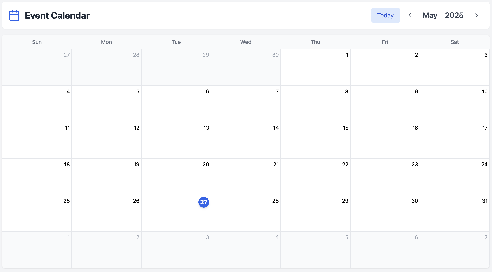

# Custom Event Calendar

An interactive calendar app built with React that allows users to create, edit, delete, and reschedule events — including support for recurring events and drag-and-drop functionality.

---

## Features

- **Monthly calendar view** with intuitive navigation
- **Event management** - create, edit, and delete events
- **Recurring events** support (daily, weekly, monthly, custom)
- **Drag-and-drop rescheduling** for seamless event management
- **Local storage persistence** - your events are saved automatically
- **Search and filtering** capabilities for easy event discovery
- **Conflict detection** to prevent overlapping events
- **Responsive design** that works on desktop and mobile

---

## Tech Stack

- **React** - Frontend framework
- **TypeScript** - Type safety and better development experience
- **TailwindCSS** - Utility-first CSS framework
- **date-fns** - Modern JavaScript date utility library
- **React DnD** - Drag-and-drop functionality
- **Vite** - Build tool and development server

---

## Setup Instructions

### 1. Clone the Repository
```bash
git clone https://github.com/aman3255/custom-event-calendar.git
cd custom-event-calendar
```

### 2. Install Dependencies
```bash
npm install
```

### 3. Start the Development Server
```bash
npm run dev
```

The app will be available at `http://localhost:5173` (or the port shown in the terminal).

---

## Usage

1. **Navigate the Calendar**: Use the arrow buttons to move between months
2. **Add Events**: Click on any day to create a new event
3. **Edit Events**: Click on an existing event to modify its details
4. **Drag & Drop**: Click and drag events to reschedule them
5. **Recurring Events**: Set up events that repeat daily, weekly, monthly, or with custom patterns
6. **Search**: Use the search bar to quickly find specific events

---

## Notes

- **Data Persistence**: Events are automatically saved in local storage, so your data persists between browser sessions
- **No Backend Required**: This is a client-side application that runs entirely in your browser
- **Browser Compatibility**: Compatible with all modern browsers (Chrome, Firefox, Safari, Edge)
- **Responsive**: Optimized for both desktop and mobile devices

---

## Development

### Project Structure
```
Custom Event Calendar/
├── eslint.config.js        # ESLint configuration
├── index.html              # Main HTML file
├── package.json            # Dependencies and scripts
├── package-lock.json       # Dependency lock file
├── postcss.config.js       # PostCSS configuration
├── tailwind.config.js      # TailwindCSS configuration
├── tsconfig.json           # TypeScript configuration
├── tsconfig.app.json       # App-specific TypeScript config
├── tsconfig.node.json      # Node-specific TypeScript config
├── vite.config.ts          # Vite build configuration
└── src/
    ├── App.tsx             # Main application component
    ├── main.tsx            # Application entry point
    ├── index.css           # Global styles
    ├── vite-env.d.ts       # Vite environment types
    ├── components/         # React components
    │   ├── CalendarDay.tsx      # Individual calendar day
    │   ├── CalendarGrid.tsx     # Calendar grid layout
    │   ├── CalendarHeader.tsx   # Calendar navigation header
    │   ├── EventItem.tsx        # Event display component
    │   └── EventModal.tsx       # Event creation/editing modal
    ├── context/            # React Context for state management
    │   └── CalendarContext.tsx  # Global calendar state
    ├── types/              # TypeScript type definitions
    │   └── index.ts            # All type definitions
    └── utils/              # Utility functions
        └── dateUtils.ts        # Date manipulation utilities
```

### Key Components
- `Calendar` - Main calendar grid view
- `EventForm` - Modal for creating/editing events
- `EventCard` - Individual event display component
- `SearchBar` - Event search and filtering
- `RecurrenceOptions` - Recurring event configuration
---
